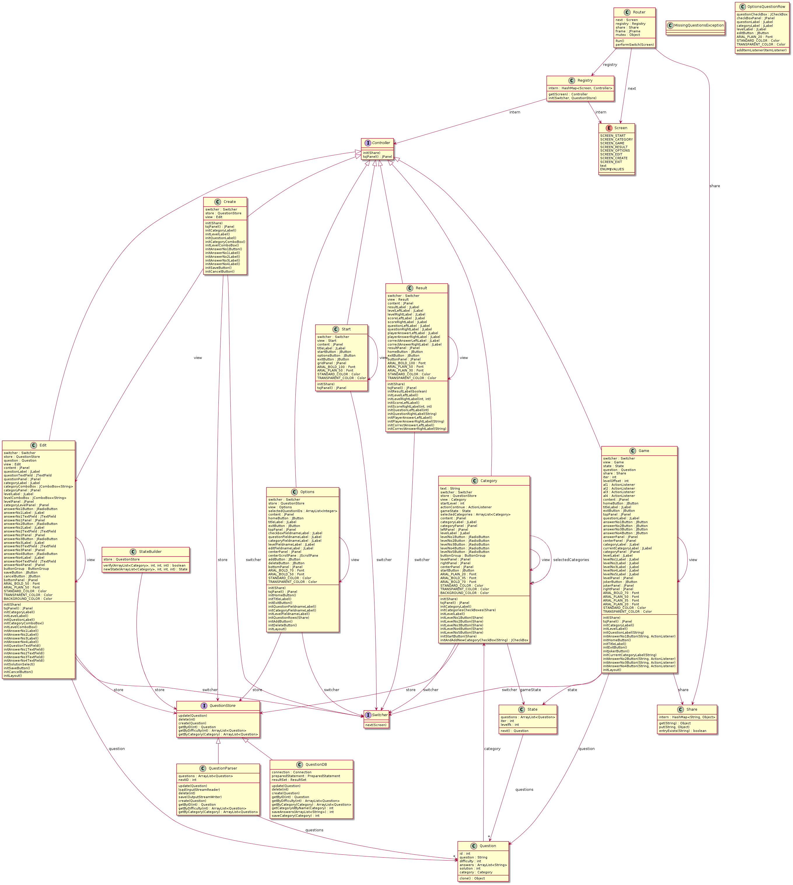

# AE Quiz Projekt

## Release

Die neuste Spielversion wird im github release als `.jar` zum Download angeboten. 

Siehe [hier](https://github.com/MninaTB/AE_Quiz_Projekt24/releases).

## Selbst kompilieren

Dieser Vorgang wird in drei Schritte unterteilt:

- Herunterladen der Abhaengigkeiten
- Kompilieren des Projekts
- Packen der `.jar` Datei

Für alle Schritte gibt es eine `Make` Regel.

```bash
make dependencies
make build
make jar
```

## Starten

Das Programm nimmt bis zu drei Argumente entgegen.

Enthaelt das erste Argument den string
- `json` wird versucht Fragen aus dieser Datei zu lesen (Parameter(1): Dateiname)
- `sql` wird versucht eine Verbindung zu einer mysql Datenbank aufzubauen (Parameter(1): URL, Parameter(2): Nutzername, Parameter(3): Passwort) 
- wird kein Parameter angegeben, versucht das Programm `question.json` zu lesen.

Beispiele:
```bash
# ohne Parameter
java -jar {app}.jar
# alternativ Datei
java -jar {app}.jar alternativer_file.json 
# Verbinde mit Datenbank
java -jar {app}.jar jdbc:mysql://localhost:3306/quiz nutzername passwort
```

## Initialisierung der Datenbank
Im Ordner `scripts` befindet sich eine SQL-Datei welche zum anlegen der Tabellen genutzt werden kann.

Beispiel:
```bash
mysql -u username -p database_name < file.sql
```

## UML

Uebersicht:


