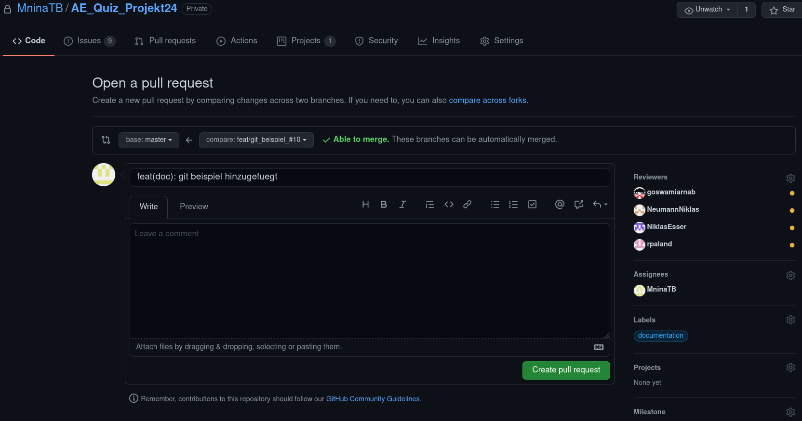

# Wie man git nutzt
Diese Dokumentation soll dabei helfen die Arbeit mit git besser zu verstehen und umsetzen zu können. Es soll die Arbeitsschritte in einem Leitfaden darstellen und kurz und knapp erklären, was die einzelnen "Bausteine" von git bedeuten und wie man sie einsetzen kann.

## Was sind Branches?
Ein Git Branch repräsentiert eine unabhängige Entwicklungslinie. Neue Commits werden in der Historie des aktuellen Branches festgehalten, was in einem Fork in der Historie des Projekts resultiert.

## Wie erzeuge ich einen Branch?
Mit dem Befehl `git branch` können wir Branches erstellen, auflisten, umbenennen und löschen.
Mit ``git checkout -b <name>`` können wir einen Branch erzeugen und in den spitzen Klammern benennen.


## Welche Branches gibt es bereits und auf welchem Branch befinde ich mich zurzeit?
Mit dem Befehl `git branch` können wir alle Branches in dem Projekt sehen. Dabei zeigt uns das * Symbol auf welchem Branch wir uns aktuell befinden.

Beispiel: 
```
$ git branch
* feat/git_beispiel_#10
  master
```

## Wie wechselt man zwischen den Branches?

Mit dem Befehl `git checkout <branchname>` kann man auf einen anderen Branch wechseln.

## Was ist ein Commit?

Mit dem Befehl `git commit` erfasst du einen Snapshot der aktuell bereitgestellten Änderungen des Projekts. Committete Snapshots gelten als "sichere" Versionen eines Projekts – Git nimmt an ihnen nur auf explizite Anweisung hin Änderungen vor. Vor dem Ausführen von `git commit` wird der Befehl `git add <dateiname>` eingesetzt, um Änderungen die in einem Commit gespeichert werden sollen, in das Projekt zu befördern oder zu "stagen".  

### Was bedeutet stagen?
Beim stagen werden Dateien markiert, welche im commit berücksichtigt werden sollen. Welche Dateien bereits gestaged sind lässt sich durch `git status` jederzeit überprüfen. 

## Wie committe ich etwas?

Als erstes werden die Dateien die man committen möchte durch `git add` gestaged. Danach lassen die Dateien sich über den Befehl `git commit -m "feat(doc): git beispiel hinzugefuegt"`committen. Innerhalb der Anführungszeichen wird die Nachricht welche den Zustand des Programms beschreibt geschrieben. 

## Erzeugen eines Pull Requests

Nachdem wir unsere Änderungen erfolgreich committet haben, können wir sie mithilfe des Befehls `git log -n <Anzahl der Commits die angezeigt werden sollen>`auflisten. 
Beispiel:
```bash
$ git log -n 2
commit cd106f6a0f93f1e1afc61e2bcced8ff959b8fc4c (HEAD -> feat/git_beispiel_#10)
Author: Nina Olear <pninak@web.de>
Date:   Fri Apr 16 23:17:21 2021 +0200

    feat(doc): git beispiel hinzugefuegt

commit a03d1946876900da52144e1820042012e879c8cd (origin/master, master)
Author: Nina Olear <pninak@web.de>
Date:   Fri Apr 16 21:55:35 2021 +0200

    initial commit
```

Im nächsten Schritt müssen die Änderungen an den Github Server übertragen werden. 
Das können wir durch den Befehl: `git push origin <branch Name>` erreichen.
Beispiel:
`git push origin feat/git_beispiel_#10`

Nun geht man auf die Github Seite wählt die Reviewer aus die diese Änderungen prüfen sollen, trägt sich selbst als assigne ein und wählt das passende label aus. 




## Kurzer Leitfaden

Szenario: 
Man möchte ein Ticket bearbeiten, in welcher Reihenfolge der Arbeitsschritte muss man nun vorgehen?

1. Branch erzeugen
2. Änderungen vornehmen
3. Committen
4. Gegebenenfalls weitere Änderungen vornehmen und erneut committen
5. Änderungen auf den Github Server übertragen (pushen)
6. Auf der Github Webseite einen Pullrequest stellen


