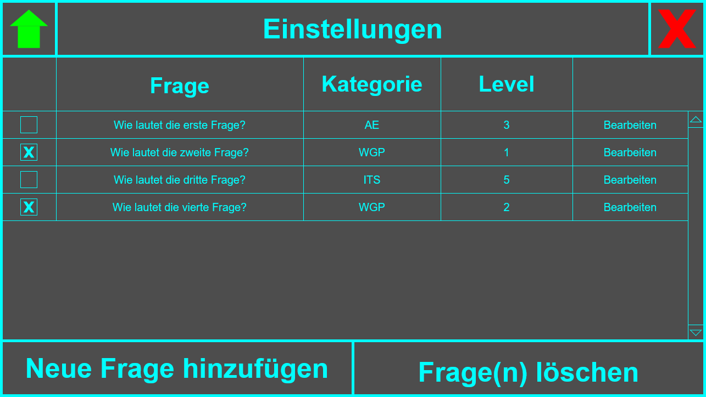
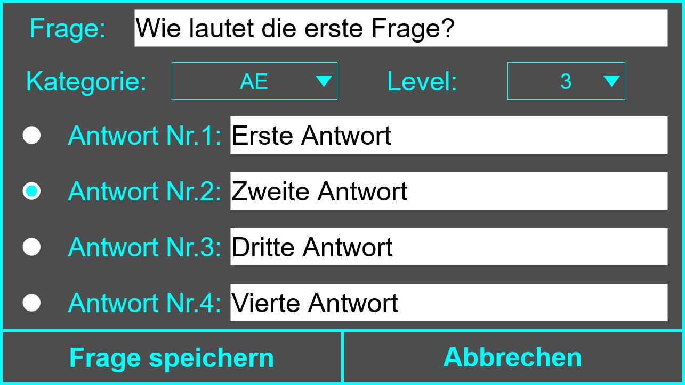
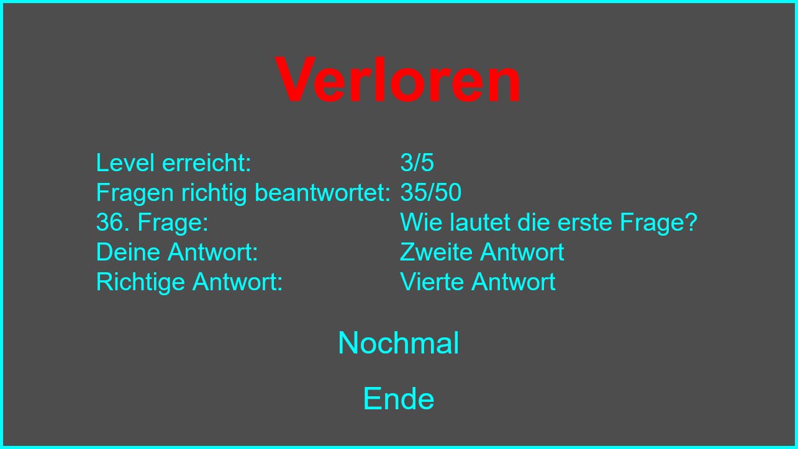

# Ideen für Screens und GUIs
Diese Dokumentation soll Ideen für die Anzahl der möglichen Screens und deren GUIs dokumentieren.

## Wie viele und welche Screens werden benötigt?
1. **Start-Screen** - Ein Screen mit Game-Title und einem Start-Button und einem Exit-Button
2. **Game-Screen** - Ein Screen, der das eigentliche Spiel präsentiert
3. **Options-Screen** - Ein Screen, um Fragen hinzuzufügen, bearbeiten und löschen zu können
4. **Edit-Screen** - Ein Screen, um eine Frage zu bearbeiten und zu speichern
5. **Result-Screen** - Ein Screen, der das Ergebnis und den Punktestand anzeigt mit einem Again-Button und einem Exit-Button

## 1. Start-Screen
### Funktionen des Screens
- Das Spiel starten
- Die Einstellungen öffnen
- Das Spiel schließen

### Komponenten
- **Title-Label** - Der Name des Spiels
- **Start-Button** - Ein Button, der zum Game-Screen führt
- **Options-Button** - Ein Button, der zum Options-Screen führt
- **Exit-Button** - Ein Button, der das Spiel schließt

### Zeichnung

## 2. Game-Screen
### Funktionen des Screens
- Zurück zum Start-Screen gehen
- Das Spiel schließen
- Einen der 4 Antworten auswählen
- Mit dem 50/50 Joker 2 falsche Antworten entfernen
- Die aktuelle Kategorie anzeigen
- Das aktuelle Level und die aktuelle Frage anzeigen

### Komponenten
- **Title-Label** - Der Name des Spiels
- **Home-Button** - Ein Button, der zum Start-Screen zurück geht
- **Exit-Button** - Ein Button, der das Spiel schließt
- **Question-Label** - Die aktuelle Frage
- **Answer-Buttons** - Die 4 Antworten-Buttons (1 richtig, 3 falsch)
- **Category-Labels** - Liste der 3 Kategorien und die aktuelle Kategorie zeigt
- **Level-Labels** - Liste aller Level und das aktuelle Level und aktuelle Frage zeigt
- **Joker-Button** - Ein Button, der 2 falsche Antworten entfernt

### Zeichnungen

## 3. Options-Screen
### Funktionen des Screens
- Liste aller Fragen wird angezeigt, jede Frage kann bearbeitet werden
- Neue Frage hinzufügen
- Frage(n) löschen durch Checkbox(en)

### Komponenten
- **Title-Label** - Der Name des Spiels
- **Home-Button** - Ein Button, der zum Start-Screen zurück geht
- **Exit-Button** - Ein Button, der das Spiel schließt
- **Delete-Checkbox** - Eine Checkbox, zur Auswahl der löschenden Fragen
- **Question-Label** - Die Frage anzeigen
- **Categorie-Label** - Die Kategorie der Frage anzeigen
- **Level-Label** - Das Level der Frage anzeigen
- **Edit-Button** - Ein Button, der zum Edit-Screen führt, der ausgefühlt ist mit den Informationen der Frage, weil die Frage bereits existiert
- **Add-Button** - Ein Button, der zum Edit-Screen führt, der leer ist, weil eine neue Frage erstellt wird
- **Delete-Button** - Ein Button, der alle Fragen löscht, die gecheckt sind bei der Delete-Checkbox

### Zeichnung

## 4. Edit-Screen
### Funktionen des Screens
- Textfelder zur Eingabe für Frage und Antworten zu bearbeiten oder neu zu schreiben
- Kategorie und Level auswählbar (Kategorie noch irgendwie neue Kategorie hinzufügen können)
- Richtige Antwort auswählbar mit Radio-Button
- Frage speichern
- Vorgang abbrechen

### Komponenten
- **Question-Label** - "Frage:" vor dem Question-TextField
- **Question-TextField** - Textfeld, zur Eingabe der Frage
- **Categorie-Label** - "Kategorie:" vor der Categorie-ComboBox
- **Categorie-ComboBox** - Eine ComboBox, zum auswählen der Kategorie
- **Level-Label** - "Level:" vor der Level-ComboBox
- **Level-ComboBox** - Eine ComboBox, zum auswählen des Levels
- **Add-Button** - Ein Button, der neue Frage hinzufügt
- **Answer-RadioButtons** - RadioButtons, zur Auswahl der richtigen Antwort
- **Answer-Labels** - "Antwort-Nr.(Zahl):" vor dem jeweiligen Answer-TextField
- **Answer-TextFields** - Textfelder, zur Eingabe der Antworten
- **Save-Button** - Ein Button, der zum Options-Screen führt und die Änderungen speichert
- **Cancel-Button** - Ein Button, der zum Options-Screen führt und die Änderungen verwirft

### Zeichnung

## 5. Result-Screen
### Funktionen des Screens
- Das Ergebnis anzeigen
- Das erreichte Level anzeigen
- Die erreichte Frage anzeigen
- Wenn Verloren, die falsch beantwortete Frage mit falsch gewählter und richtiger Antwort anzeigen
- Das Spiel (erneut) starten
- Das Spiel schließen

### Komponenten
- **Result-Label** - Das Ergebnis des Spiels, ob Gewonnen oder Verloren
- **Level-Label** - Die Anzahl der erreichten Level
- **Score-Label** - Die Anzahl der richtig beantworteten Fragen
- **Question-Label** - Die falsch beantwortete Frage
- **YourAnswer-Label** - Die falsch gewählte Antwort
- **RightAnswer-Label** - Die richtige Anwort
- **Again-Button** - Ein Button, der zum Game-Screen führt
- **Exit-Button** - Ein Button, der das Spiel schließt

### Zeichnung

## Zeichnung bearbeiten
Mit den .drawio-Files hat man die Möglichkeit die Zeichnungen(.png-Files) weiter zu bearbeiten im Browser unter https://app.diagrams.net/?src=about oder sich  die Anwendung zu downloaden.

### Files
- `assets/EditableStartGUI.drawio`
- `assets/EditableGameGUI.drawio`
- `assets/EditableOptionsGUI.drawio`
- `assets/EditableEditGUI.drawio`
- `assets/EditableResultGUI.drawio`
- `assets/StartGUI.png`
- `assets/GameGUI.png`
- `assets/OptionsGUI.png`
- `assets/EditGUI.png`
- `assets/ResultGUI.png`
