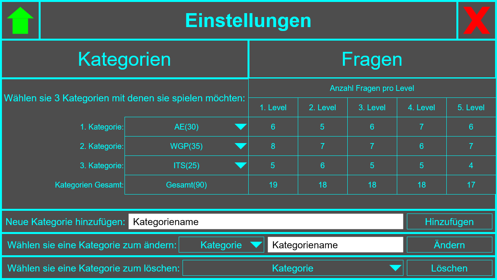
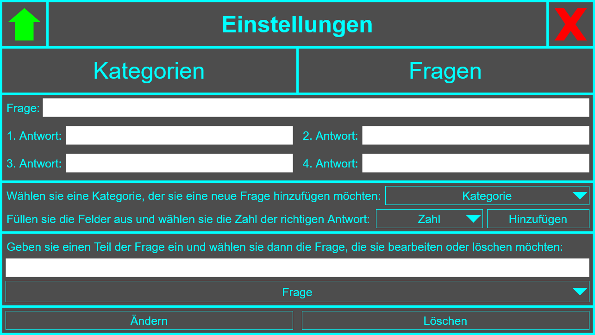

# Ideen für Screens und GUIs
Diese Dokumentation soll Ideen für die Anzahl der möglichen Screens und deren GUIs dokumentieren.

## Wie viele und welche Screens werden benötigt?
1. **Start-Screen** - Ein einfacher Screen mit Game-Title und einem Start-Button und einem Exit-Button
2. **Game-Screen** - Ein komplexer Screen, der das eigentliche Spiel präsentiert
3. **Options-Screen** - Ein komplexer Screen, um Kategorien und Fragen hinzuzufügen, bearbeiten und löschen zu können
4. **End-Screen** - Ein einfacher Screen, der das Ergebnis und den Punktestand anzeigt mit einem Again-Button und einem Exit-Button

## 1. Start-Screen
### Funktionen des Screens
- Das Spiel starten
- Die Einstellungen öffnen
- Das Spiel schließen

### Komponenten
- **Title-Label** - Der Name des Spiels
- **Start-Button** - Ein Button, der zum Game-Screen führt
- **Options-Button** - Ein Button, der zum Options-Screen führt
- **Exit-Button** - Ein Button, der das Spiel schließt

### Zeichnung

## 2. Game-Screen
### Funktionen des Screens
- Zurück zum Start-Screen gehen
- Das Spiel schließen
- Einen der 4 Antworten auswählen
- Mit dem 50/50 Joker 2 falsche Antworten entfernen
- Die aktuelle Kategorie anzeigen
- Das aktuelle Level und die aktuelle Frage anzeigen

### Komponenten
- **Title-Label** - Der Name des Spiels
- **Home-Button** - Ein Button, der zum Start-Screen zurück geht
- **Exit-Button** - Ein Button, der das Spiel schließt
- **Question-Label** - Die aktuelle Frage
- **Answer-Buttons** - Die 4 Antworten-Buttons (1 richtig, 3 falsch)
- **Category-Labels** - Liste der 3 Kategorien und die aktuelle Kategorie zeigt
- **Level-Labels** - Liste aller Level und das aktuelle Level und aktuelle Frage zeigt
- **Joker-Button** - Ein Button, der 2 falsche Antworten entfernt

### Zeichnungen

## 3. Options-Screen
Der Options-Screen wird in zwei Teile geteilt, einmal in OptionsCategories-Screen und in OptionsQuestions-Screen

## 3.1. OptionsCategories-Screen
### Funktionen des Screens
- 3 Kategorien auswählen für das Spiel
- Tabelle mit Anzahl Fragen pro Level anzeigen, damit User nachvollziehen kann während der Auswahl ob genug Fragen(min. 10 Fragen) für jedes Level(5 Level) vorhanden sind
- Neue Kategorie hinzufügen mit Eingabe durch Textfeld und Übermittlung durch Button
- Kategorie ändern mit Kategorieauswahl, Eingabe durch Textfeld und Übermittlung durch Button
- Kategorie löschen mit Kategorieauswahl und Übermittlung durch Button

### Komponenten
- **Title-Label** - Der Name des Spiels
- **Home-Button** - Ein Button, der zum Start-Screen zurück geht
- **Exit-Button** - Ein Button, der das Spiel schließt
- **Categories-Button** - Ein Button, der zum OptionsCategories-Screen führt
- **Questions-Button** - Ein Button, der zum OptionsQuestions-Screen führt
- **Categories-ComboBoxes** - ComboBoxes, zum auswählen der Kategorien
- **QuestionsPerLevel-Labels** - Tabelle, zur Darstellung für User
- **Category-TextFields** - Ein TextField, zur Eingabe eines Kategorienamens
- **Add-Button** - Ein Button, der neue Kategorie hinzufügt
- **Edit-Button** - Ein Button, der Änderungen an Kategorie speichert
- **Delete-Button** - Ein Button, der Kategorie löscht

### Zeichnung

## 3.2. OptionsQuestions-Screen
### Funktionen des Screens
- Textfelder zur Eingabe für neue Fragen oder Anzeigen ausgewählter Fragen zum Bearbeiten/Löschen
- Kategorie und richtige Antwort auswählen zum Hinzufügen einer neuen Frage
- Textfeld zum Suchen einer Frage
- Auswahlliste um Frage auszuwählen, die in den Textfeldern angezeigt wird
- Frage ändern mit Übermittlung durch Button
- Frage löschen mit Übermittlung durch Button

### Komponenten
- **Title-Label** - Der Name des Spiels
- **Home-Button** - Ein Button, der zum Start-Screen zurück geht
- **Exit-Button** - Ein Button, der das Spiel schließt
- **Categories-Button** - Ein Button, der zum OptionsCategories-Screen führt
- **Questions-Button** - Ein Button, der zum OptionsQuestions-Screen führt
- **QuestionAnswers-TextFields** - Textfelder, zur Eingabe für neue Fragen oder Anzeigen ausgewählter Fragen zum Bearbeiten/Löschen
- **Categories-ComboBox** - Eine ComboBox, zum auswählen der Kategorie
- **Number-ComboBox** - Eine ComboBox, zum auswählen der Zahl, der richtigen Antwort
- **Add-Button** - Ein Button, der neue Frage hinzufügt
- **Search-TextField** - Ein Textfeld, zum Suchen einer Frage
- **Question-ComboBox** - Eine ComboBox, zur Auswahl einer Frage
- **Edit-Button** - Ein Button, der Änderungen an Frage speichert
- **Delete-Button** - Ein Button, der Frage löscht

### Zeichnung

## 4. End-Screen
### Funktionen des Screens
- Das Ergebnis anzeigen
- Das erreichte Level anzeigen
- Die erreichte Frage anzeigen
- Wenn Verloren, die falsch beantwortete Frage mit falsch gewählter und richtiger Antwort anzeigen
- Das Spiel (erneut) starten
- Das Spiel schließen

### Komponenten
- **Result-Label** - Das Ergebnis des Spiels, ob Gewonnen oder Verloren
- **Level-Label** - Die Anzahl der erreichten Level
- **Score-Label** - Die Anzahl der richtig beantworteten Fragen
- **Question-Label** - Die falsch beantwortete Frage
- **YourAnswer-Label** - Die falsch gewählte Antwort
- **RightAnswer-Label** - Die richtige Anwort
- **Again-Button** - Ein Button, der zum Game-Screen führt
- **Exit-Button** - Ein Button, der das Spiel schließt

### Zeichnung

## Zeichnung bearbeiten
Mit den .drawio-Files hat man die Möglichkeit die Zeichnungen(.png-Files) weiter zu bearbeiten im Browser unter https://app.diagrams.net/?src=about oder sich  die Anwendung zu downloaden.

### Files
- `assets/EditableStartGUI.drawio`
- `assets/EditableGameGUI.drawio`
- `assets/EditableOptionsCategoriesGUI.drawio`
- `assets/EditableOptionsQuestionsGUI.drawio`
- `assets/EditableEndGUI.drawio`
- `assets/StartGUI.png`
- `assets/GameGUI.png`
- `assets/OptionsCategoriesGUI.drawio`
- `assets/OptionsQuestionsGUI.drawio`
- `assets/EndGUI.png`
