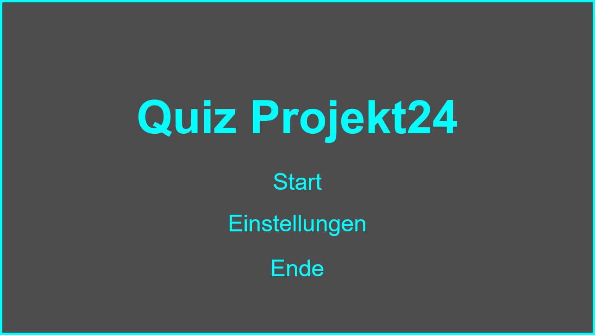
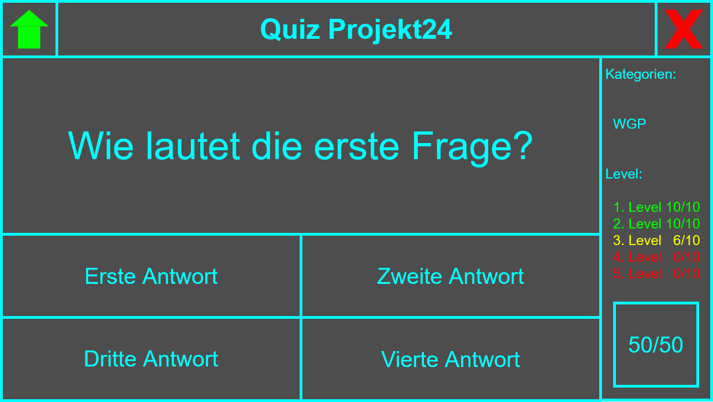

# Ideen für Screens und GUIs
Diese Dokumentation soll Ideen für die Anzahl der möglichen Screens und deren GUIs dokumentieren.

## Wie viele und welche Screens werden benötigt?
1. **Start-Screen** - Ein einfacher Screen mit Game-Title und einem Start-Button und einem Exit-Button
2. **Game-Screen** - Ein komplexer Screen, der das eigentliche Spiel präsentiert
3. **End-Screen** - Ein einfacher Screen, der das Ergebnis und den Punktestand anzeigt mit einem Again-Button und einem Exit-Button

## 1. Start-Screen
### Funktionen des Screens
- Das Spiel starten
- Das Spiel schließen

### Komponenten
- **Title-Label** - Der Name des Spiels
- **Start-Button** - Ein Button, der zum Game-Screen führt
- **Exit-Button** - Ein Button, der das Spiel schließt

### Zeichnung

## 2. Game-Screen
### Funktionen des Screens
- Zurück zum Start-Screen gehen
- Das Spiel schließen
- Einen der 4 Antworten auswählen
- Mit dem 50/50 Joker 2 falsche Antworten entfernen
- Das aktuelle Level anzeigen

### Komponenten
- **Title-Label** - Der Name des Spiels
- **Home-Button** - Ein Button, der zum Start-Screen zurück geht
- **Exit-Button** - Ein Button, der das Spiel schließt
- **Question-Label** - Die aktuelle Frage
- **Level-Labels** - Liste aller Level und das aktuelle Level zeigt
- **Answer-Buttons** - Die 4 Antworten-Buttons (1 richtig, 3 falsch)
- **Joker-Button** - Ein Button, der 2 falsche Antworten entfernt (Optional)

### Zeichnung

## 3. End-Screen
### Funktionen des Screens
- Das Ergebnis anzeigen
- Den Punktestand anzeigen
- Das Spiel (erneut) starten
- Das Spiel schließen

### Komponenten
- **Result-Label** - Das Ergebnis des Spiels, ob Gewonnen oder Verloren
- **Score-Label** - Die Anzahl der richtigen Antworten
- **Again-Button** - Ein Button, der zum Game-Screen führt
- **Exit-Button** - Ein Button, der das Spiel schließt

### Zeichnung

## Zeichnung bearbeiten
Mit den .drawio-Files hat man die Möglichkeit die Zeichnungen(.png-Files) weiter zu bearbeiten im  oder sich  die Anwendung zu downloaden.

### Files
- `assets/EditableStartGUI.drawio`
- `assets/EditableGameGUI.drawio`
- `assets/EditableEndGUI.drawio`
- `assets/StartGUI.png`
- `assets/GameGUI.png`
- `assets/EndGUI.png`
