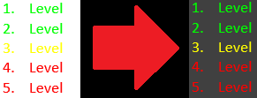

# Fragen zur weiteren GUI Gestaltung
Diese Dokumentation soll Fragen zur weiteren GUI Gestaltung dokumentieren, die dann im Review beantwortet und diskutiert werden sollen.

## 1. Frage
Ich habe mal einen Farbtest gemacht wegen dem Ampelsystem und um das Gelb hervorzuheben habe ich dem Hintergrund einen Grauton verpasst.
Dadurch wurde die restliche Schriftfarbe schlecht lesbar, diese habe ich dann mit Hellblau ausgeglichen.

### Was haltet ihr davon?

(Bei den Beispielen **bitte** den schwarzen Bereich mit dem rotem Pfeil **nicht beachten!**)

### Beispiel Nr. 1: Levels

### Beispiel Nr. 2: GameTitle

### Beispiel Nr. 3: QuestionAnswersField

## 2. Frage
Haben wir eine fixe Anzahl an Kategorien? Also z.B. 3 Kategorien: WGP, AE, ITS und das bleibt so für immer,
keine weitere Kategorie kann hinzugefügt werden.  
- **Wenn dem so wäre** könnte man das schöne mit Buttons realisieren,
die auch das Ampelsystem nutzen würden, also Rot für nicht-ausgewählte Kategorien und Grün für die ausgewählte Kategorie.  
- **Wenn dem nicht so wäre** würde ich das mit einer ComboBox realisieren, wo sich die farbliche Gestaltung als schwierig erweisen würde.
Ich persönlich würde die fixe Anzahl mit Buttons bevorzugen.

### Was wäre euch lieber oder habt ihr noch andere Ideen?

### Beispiel: Wenn dem so wäre ...

## 3. Frage
Es gab scheinbar ein Missverständnis meinerseits, ich dachte ein Level wäre eine Frage, aber ein Level sind 10 Fragen.
Ich hatte ja 10 Level eingetragen und das wären somit 100 Fragen mit nur einem Joker, ein bisschen übertrieben.
Ich würde das auf 5 Level (50 Fragen) reduzieren womit ich mir auch direkt Platz schaffe für die Kategorien.

### Was haltet ihr davon?

### Beispiel: CategoriesLevelsField

## 4. Frage
Wegen den bisher noch nicht vorhanden Edit-Screens muss ich noch kreativ sein, aber die 1. Frage müsste ich dazu beantwortet haben.
Ob ich dem Screen auch das Hinzufügen neuer Kategorien einbaue oder nicht statt nur Fragen erstellen und bearbeiten.

### Wie ist es mit Fragen löschen?

## 5. Frage
Aber zu dem Edit-Button würde ich schon einmal sagen, dass er auf dem Start-Screen kommt zwischen dem Start- und Exit-Button.

### Was haltet ihr davon?

## 6. Frage (abseits vom Thema)
Es haben sich inzwischen sehr viele Bild-Dateien angesammelt im doc-Verzeichnis. Da verliert man langsam die Übersicht dort.
Wie wäre es mit einem doc/pic-Verzeichnis, wo alle Bild-Dateien (auch .drawio) reinkommen?  
**ACHTUNG!!!** Bei Änderung müssen dann auch die Markdown-Dateien angepasst werden.

### Was haltet ihr davon?
