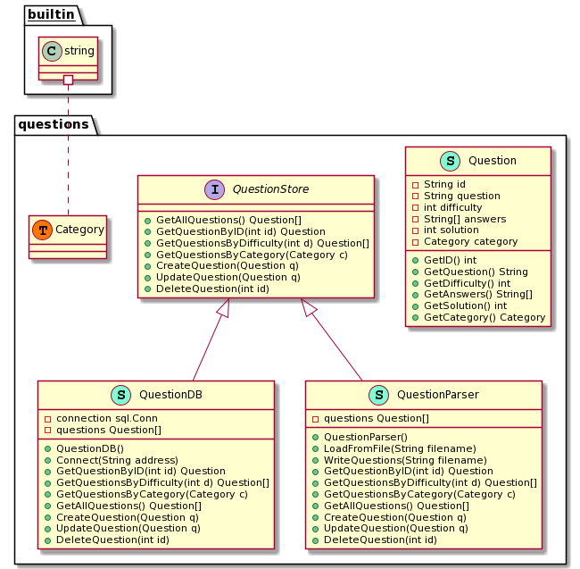

# Übersicht Package - questions

## Erklärung
### Warum ein eigenes Package?
Da die Funktionalität unseres QuestionStores wiederverwendbar ist und in sich ein eigenes schlüssiges System ist, kann man ein eigenes Package bereitstellen. Das Package muss dann in ein beliebiges Hauptprogramm importiert werden. 

Beispiel: 
`import java.lang.math` - Dies ist ein Package das einige mathematische Operationen enthält und in ein beliebiges Hauptprogramm importiert werden kann.

### Erklärung zum UML
**Datentyp (Klasse) Question:**

 - Stellt die Ansammlung an Attributen zusammen, die eine Frage beinhalten sollte
 - Sie hat eine eindeutige Identifikationsnummer `id`
 - Sie ist serialisierbar - sie kann also aus einem json erzeugt und darin gespeichert werden 

**Question Store - Interface:**

 - Dabei handelt es sich um eine Schnittstelle zur Datenhaltung

**Question Parser:**

 - Implementiert das QuestionStore Interface
 - Ermöglicht das Laden und das Speichern, einer Liste von Fragen vom Dateisystem

**QuestionDB:**

 - Implementiert das QuestionStore Interface
 - Ermöglicht das Laden und das Speichern einer Liste von Fragen einer SQL-Datenbank

## UML

