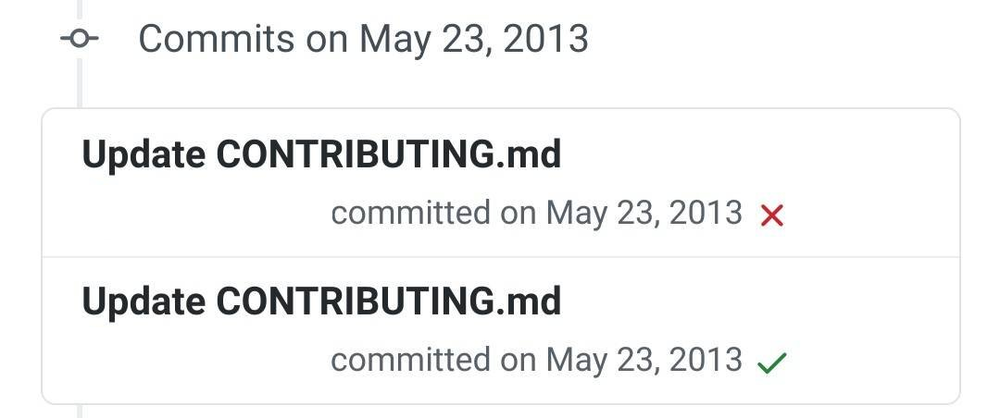

# Tests über Github automatisieren

## Github Actions
Unter Github Actions kann man einen Workflow einrichten um Tests automatisch durchlaufen zu lassen.  
Wählt man einen Workflow unter Github Actions aus, hat man erstmal eine Art Grundgerüst auf dem man nun aufbauen und welches man nun modifizieren und auf seine Bedürfnisse anpassen kann.

## Beschreibung von Workflows
Ein Workflow für Github Actions wird in einer `yaml`- Datei beschrieben. Wichtige Einträge in der `yaml` Datei sind:
 - **name:** "Der Name unserer action"
 - **on:** "Wann wird die action gestartet"
 - **runs on:** "Startet einen Container in dem die action läuft"

Um über Github Actions Tests ausführen zu lassen sind vor allem die steps wichtig:
 - **steps:** "Steps beschreiben eine Reihenfolge von Kommandos die auf den oben gewählten Betriebssystem ausgeführt werden"
```
    steps:
      # Ein Beispielkommando das auf der Konsole "Hello World" ausgibt
      - name: Run a one-line script
        run: echo Hello, world!

      # Ein weiteres Beispielkommando das auf der Konsole "Guten Tag, Welt" ausgibt
      - name: Run a one-line script
        run: echo Guten Tag, Welt
```
Diese Eigenschaft der steps können wir verwenden um über die Kommandozeile den Java Build Prozess und Java Tests auszuführen.
Der Build Schritt überprüft das Kompilieren des Programms. Im nächsten Schritt können die Unit Tests ausgeführt werden um zu prüfen ob die Unit Tests erfolgreich durchlaufen werden. 

## Resultat
Der Vorteil dieses Ablaufs besteht daraus, dass automatisiert beim Erstellen eines Pull Requests um beim Mergen auf den Masterbranch geprüft wird, ob das Programm kompiliert werden kann und die bestehenden Tests erfolgreich durchlaufen werden können. Der Entwickler erhält am Ende ein Feedback für seinen Commit ob alle Tests positiv abgeschlossen wurden. Das Feedback findet in Form eines grünen Häckchens statt:


