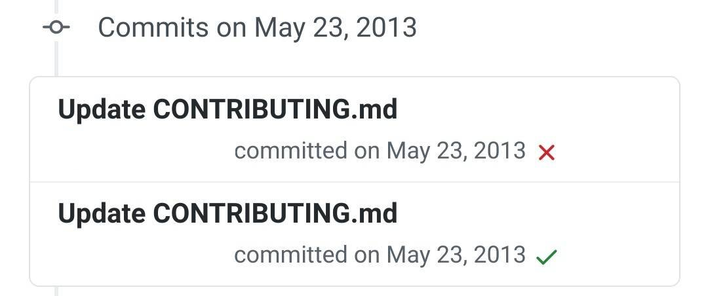

# Tests über Github automatisieren

## Github Actions
Unter Github Actions kann man einen Workflow einrichten um Tests automatisch durchlaufen zu lassen.  
Wählt man einen Workflow unter Github Actions aus, hat man erstmal eine Art Grundgerüst auf dem man nun aufbauen und welches man nun modifizieren und auf seine Bedürfnisse anpassen kann.

## Was ist ein Workflow?
Ein Workflow für Github Actions wird in einer `yaml`- Datei beschrieben. Wichtige Einträge in der `yaml` Datei sind:
 - **name:** "Der Name unserer action"
 - **on:** "Wann wird die action gestartet"
 - **runs on:** "Startet einen [Container](https://www.redhat.com/de/topics/containers/what-is-docker) in dem die action läuft"
 - **steps:** "Beschreiben eine Reihenfolge von Kommandos die auf einem gewählten "Betriebssystem" (Container) ausgeführt werden"


### Beschreibung auszuführender Schritte
Das folgende Beispiel soll zeigen wie einzelne Schritte beschrieben werden.
```
    steps:
      # Ein Beispielkommando das auf der Konsole "Hello World" ausgibt
      - name: Run a one-line script
        run: echo Hello, world!

      # Ein weiteres Beispielkommando das auf der Konsole "Guten Tag, Welt" ausgibt
      - name: Run a one-line script
        run: echo Guten Tag, Welt
```

### Automatische Java tests
Diese Eigenschaft der steps können wir verwenden um über die Kommandozeile den Java Build Prozess und Java Tests auszuführen. Vorab, es gibt viele möglichkeiten Java Programme zu kompilieren. Da unser Projekt recht klein ist, haben wir uns für die Kommandozeilen Vairante entschieden. Alternativ lassen sich bsp.: [Maven](https://maven.apache.org/), [ant](https://ant.apache.org/) und [gradle](https://gradle.org/) verwenden.
Es gibt viele vorgefährtigte Workflows um Java Programme auszuführen und/oder zu testen. Um die Komplexität und Abhängkeiten gering zu halten, haben wir uns hier auch für eine Eigene Variante die `javac` nutzt entschieden.

#### Kompilieren ohne Abhängigkeiten
Das ist z.b. direkt über den [javac](https://www.manpagez.com/man/1/javac/) Compiler möglich. Sollte unser Projekt keine externen Abhängigkeiten verweden, lässt es sich mit einem einfachen Befehl kompilieren.
```bash
javac Main.java AnotherFile.java
```
#### Kompilieren mit Abhängigkeiten
Nutzen wir allerdings externe Abhängigkeiten, müssen diese wie auch in Eclipse, dem [CLASSPATH](https://docs.oracle.com/javase/tutorial/essential/environment/paths.html) hinzugefühgt werden. Das geschieht über den parameter `-cp`.
```bash
javac -cp gson.jar:. Main.java AnotherClassThatUsesGson.java
```
#### Kompilieren und ausführen von Tests
Zunächst müssen auch unsere Tests Kompiliert werden damit wir sie mit Hilfe von [junit5](https://junit.org/junit5/docs/current/user-guide/) auf der Kommandozeile unseres Containers ausführen können.
```bash
javac -cp gson.jar:. AnotherClassThatUsesGsonTest.java
```
Anschließend benötigen wir ein lauffähiges junit5. Die Datei [junit-platform-console-standalone-1.7.1.jar](https://mvnrepository.com/artifact/org.junit.platform/junit-platform-console-standalone/1.7.1) können wir aus dem Maven repository herunterladen. (Maven ist ein java build tool, dass wir hier nicht weiter besprechen.)

Nun Laden wir das Junit5 programm und übergeben einige Parameter:
Zunächst das Program selbst, als nächstes geben wir alle benötigten Abhängigkeiten unseres Programms im classpath an. In unserem Beispiel ist es die gson Libary von google. Dann sagen wir junit es soll automatisch den Classpath nach weiteren abhänigkeiten überprüfen. Als engine verwenden wir junit-jupiter (junit5) und zum schluss wollen wir nur Java Classes mit `Test` im Namen ausführen.
```bash
	java -jar junit-platform-console-standalone-1.7.1.jar --classpath gson.jar:. \
		--scan-classpath --include-engine junit-jupiter \
		--include-classname ".*Test.*" 
``` 

#### Automatisches ausführen von Tests
Zunächst müssen wir einen Worklfow "registrieren". Dafür müssen wir unseren Workflow beschreiben und unter `.github/workflows/{WORKFLOW_NAME}.yaml` speichern.
Ein Workflow mit den vorab gezeigten Commandos könnte nun wie folgt aussehen:
```yaml
name: CI

# Gibt an wann der workflow ausgeführt wird
on:
  # Startet den workflow wenn ein push oder pull request event gegen den master branch auftritt
  push:
    branches: [ master ]
  pull_request:
    branches: [ master ]

jobs:
  build:
    # Wir waehlen ubuntu als Container fuer unsere kommandos
    runs-on: ubuntu-latest
    
    steps:
      # Unser code im repository wird unter $GITHUB_WORKSPACE zur verfuegung gestellt
      - uses: actions/checkout@v2

      # Pruefe ob Projekt kompilierbar ist           
      - name: Pruefe ob Projekt kompilierbar ist
        run: javac Main.java AnotherFile.java         

      # Fuehre Unittests des Projekts aus
      - name: Fuehre Unit tests des Projekts aus
        run: |
         wget https://repo1.maven.org/maven2/org/junit/platform/junit-platform-console-standalone/1.7.1/junit-platform-console-standalone-1.7.1.jar
         javac AnotherFileTest.java
         java -jar junit-platform-console-standalone-1.7.1.jar --scan-classpath --include-engine junit-jupiter --include-classname "AnotherFileTest"
```
Eine kurze erläuterung zum letzten Schritt, dort werden mehrere Kommandos nach einander Ausgeführt. 
1. Als erstes Laden wir die benötigte Abhängigkeit junit5 mit hilfe des Programms [wget](https://linux.die.net/man/1/wget) herunter.
2. Dann Kompilieren wir unsere Test Datei `AnotherFileTest.java`. 
3. Als letztes starten wir junit um unseren Test auszuführen.

#### Vereinfachung
In der vorher gezeigten Version müssen Java Dateien welche Kompiliert und getestet werden sollen von Hand eingetragen werden. Um zum Beispiel nun alle `.java` und `Test.java` Dateien auflisten zu lassen, können wir das tool [find](https://man7.org/linux/man-pages/man1/find.1.html) nutzen. Letzt endlich könnte so unser Workflow allerdings sehr unübersichtlich werden. Somit bietet es sich an die auszuführenden Schritte unseres Workflows in einem Script zusammen zu fassen. Nun gibt es wieder viele möglichkeiten bsp.: shell-scripts, python-scripts oder Make-scripts.
Da sich mit [Make](https://linux.die.net/man/1/make) Kommandozeilen befehle ausführen lassen und diese in verschiedenen einzelnen Regeln genutzt werden können, es ebenfalls unter fast jeder Linux Distrubution vorinstalliert ist, haben wir uns dafür entschieden.

Das Automatische ausführen unserer Prüfung haben wir in 3 Regeln unterteilt. [Stand 14.05.2021](https://github.com/MninaTB/AE_Quiz_Projekt24/blob/36e67d6dc618a87fdc77fe98925f6a5b2358cd9f/Makefile)
```bash
make dependencies
make build
make test
```

Diese Regeln in unseren Workflow Schritten eingetragen. [Stand 14.05.2021](https://github.com/MninaTB/AE_Quiz_Projekt24/blob/89a563ef1708e7437fe394487ff289f1b79445fa/.github/workflows/main.yml)

## Resultat
Der Vorteil dieses Ablaufs besteht daraus, dass automatisiert beim Erstellen eines Pull Requests um beim Mergen auf den Masterbranch geprüft wird, ob das Programm kompiliert werden kann und die bestehenden Tests erfolgreich durchlaufen werden können. Test und Normale Dateien werden Automaitisert im Repository gesucht und berücksichtigt. Der Entwickler erhält am Ende ein Feedback für seinen Commit ob alle Tests positiv abgeschlossen wurden. Das Feedback findet in Form eines grünen Häckchens statt:



Um weitere Informationen zum Build Prozess zu erhalten, kann man einfach auf die Symbole klicken.

