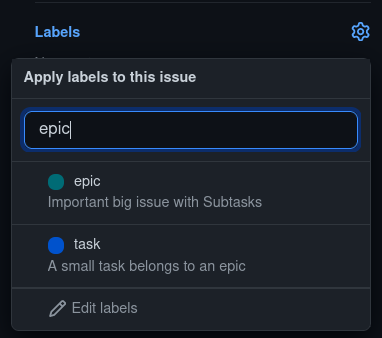

# Ticket Hierarchie

## epic
Bei einem epic handelt es sich um eine Zusammenfassung kleinerer Aufgaben. 
Ein Ticket kann man über die Labelfunktion zu einem task oder epic ernennen.

## task
Ein task stellt eine kleinere Unteraufgabe unseres epics dar. Ein task sollte maximal vier Stunden Arbeit beinhalten. Sollte der task länger dauern, wäre es angemessen diesen erneut aufzuspalten, sodass man zwei tasks hat.
